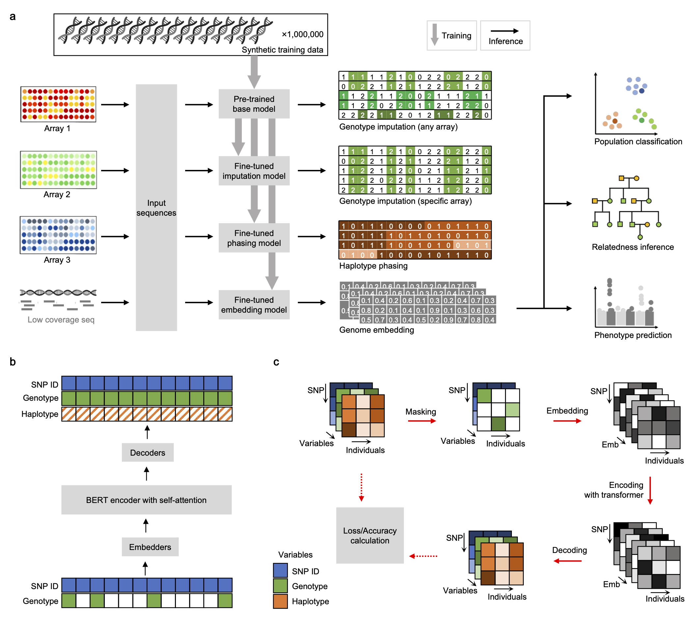

# SNPBag
Towards a universal foundation model for biobank-scale human genome variation.
- [bioRxiv](https://www.biorxiv.org/content/10.1101/2025.01.29.635579v3)

# Overview
SNPBag is a large language model pre-trained with whole-genome SNP data from 1 million synthetic individuals. It is currently fine-tuned for 4 tasks:
- genotype imputation
- haplotype phasing
- population classification
- relatedness inference

# Demo
- Under construction, not 100% finished.
- When finished, the above 4 tasks can be performed.
- Take a peek at [http://guohuaxu.com:5000](http://guohuaxu.com:5000) or [mirror](http://112.124.68.206:5000).

# Folders
Folders contain code for reproducing figures on the manuscript.
- emb: generating genome embedding.
- imputation: genotype imputation for SNP array data.
- phasing: haplotype phasing, tested with physically phased HGDP samples.
- pop_classifier: classify individuals among human populations defined by 1000 Genome Project.
- relatedness: estimate degree of genetic relatedness between individuals.

# Schema

