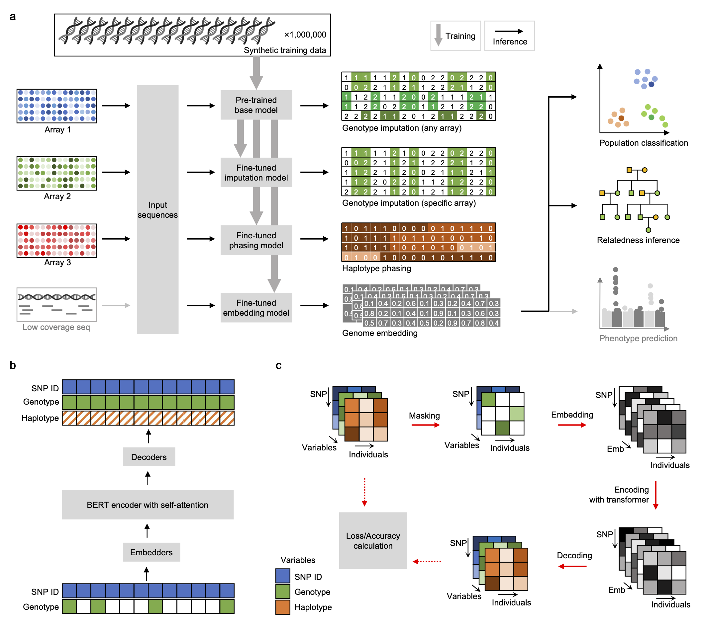

# SNPBag
Towards a universal foundation model for biobank-scale human genome variation.
- [bioRxiv](https://www.biorxiv.org/content/10.1101/2025.01.29.635579v3)

# Overview
SNPBag is a large language model pre-trained with whole-genome SNP data from 1 million synthetic individuals. It is currently fine-tuned for 5 tasks:
- genotype imputation
- haplotype phasing
- genome embedding
- ancestry inference
- relatedness inference

# Inference service (Demo)
- Four tasks are available: imputation, embedding, ancestry and relatedness inference.
- Service on [server1 with Nvidia RTX3090](http://121.40.50.52:5000).
- ~~Service on [server2 with Nvidia RTX3090](http://112.124.68.206:5000).~~
- ~~Service on [server0 with Nvidia A800](http://112.124.68.206:5000).~~

# Folders
Folders contain code for reproducing figures on the manuscript.
- emb: generating genome embedding.
- imputation: genotype imputation for SNP array data.
- phasing: haplotype phasing, tested with physically phased HGDP samples.
- pop_classifier: classify individuals among human populations defined by 1000 Genome Project.
- relatedness: estimate degree of genetic relatedness between individuals.

# Schema

